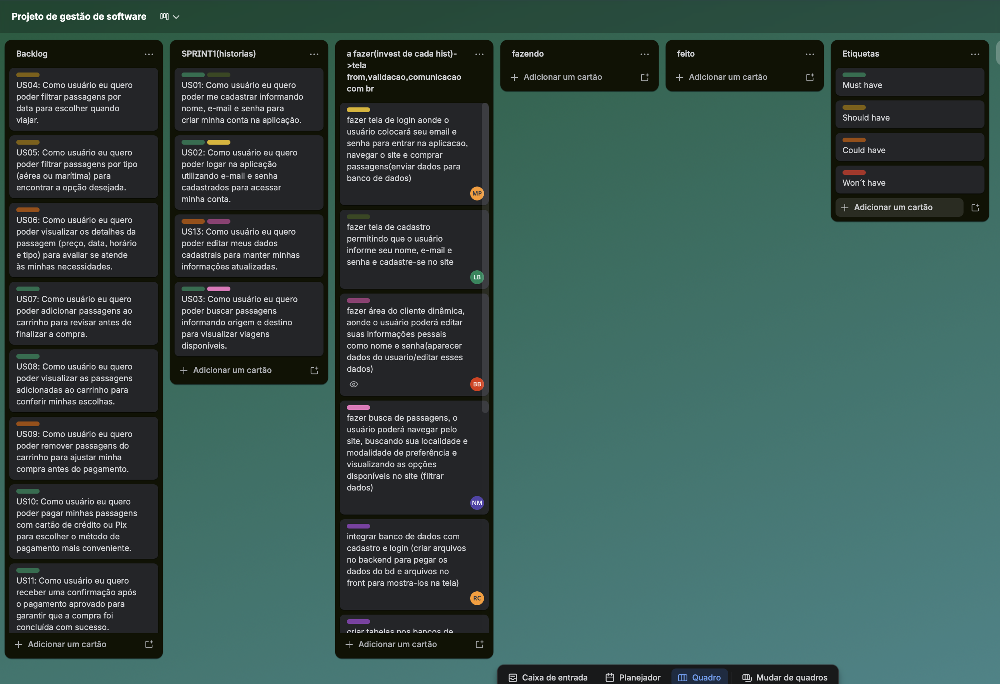
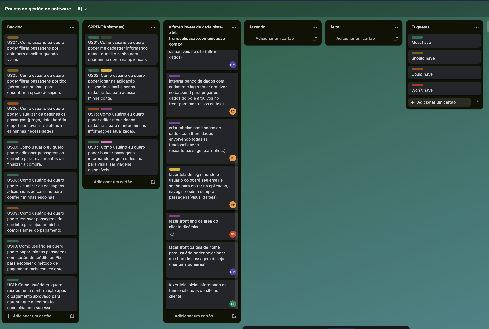

# -Horas

## Descrição
Esse projeto tem por objetivo o desenvolvimento e a gestão de uma aplicação voltada à venda de passagens aéreas e marítmicas. Por meio dele, o processo de compra dessas passagens será facilitado e otimizado, sendo possível a utilização a qualquer hora em qualquer lugar.

## Integrantes do grupos:
-Beatriz Manaia Lourenço Berto RA:22.125.060-8  
-Letizia Baptistella 22.125.063-2  
-Manuella Filipe Peres 22.224.029-3  
-Nuno Martins Guilhermino da Silva RA:22.126.099-5  
-Rafaela Altheman de Campos 22.125.062-4  

Framework: VUE

Linguagem: HTML/CSS/Javascript

## Sprint1:

### Objetivo da sprint1

#### semana1: base do projeto 
-realizer frontend das telas que serão implementadas (inicial, home, login, cadastro, area do cliente)
-criar entidades do banco de dados que sera utilizadas no projeto

#### semana2: logica de backend das telas implementadas

-implementar a validacao do cadastro e login bem como a listagem das passagens cadastradas no anco de dados e a área do cliente

